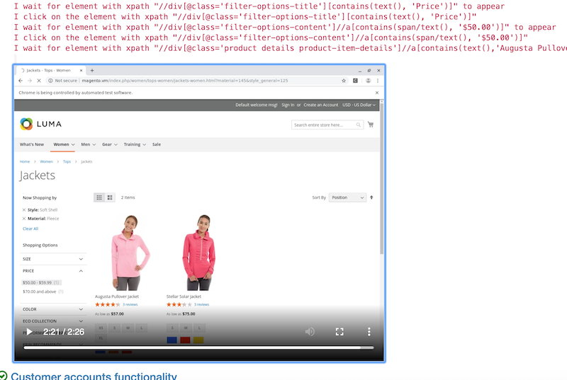

# TaaSty's Demo Repository

This is a demo repository. Its sole purpose is to demonstrate the TaaSty's
functionality (**T**esting **A**s **A** **S**ervice).

1. Make a demo request at [taasty.net](https://taasty.net/#request-demo). You'll get an
invitation to collaborate on this repository along with the demo account
credentials.
2. Clone this repository, make a branch, commit your changes,
push it back to github and make a pull request.
3. Wait for up to 15 minutes for UI tests to be completed and get the results.
Test results will be posted as comment from [taasty](https://github.com/taasty)
user in your pull request with the link to the detailed test run log
accompanied by a recorded video. Alternatively you can just visit
[TaaSty's dashboard](https://taasty.net/dashboard/).

Please note that this is not the original Magento 2 repository. The original
Magento2 publick repository from which this one was clonned is located at
[magento/magento2](https://github.com/magento/magento2).

## Screenshots

#### TaaSty's dashboard

---
#### Log view

---
#### Steps along with the video clip

---
#### Test results posted to PR on GitHub

-
